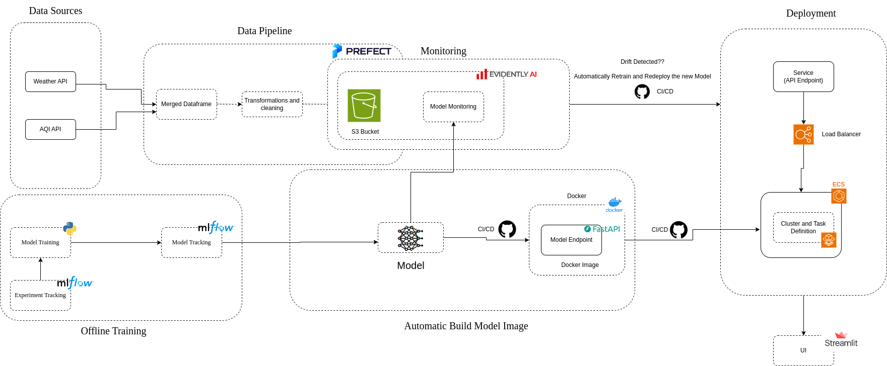
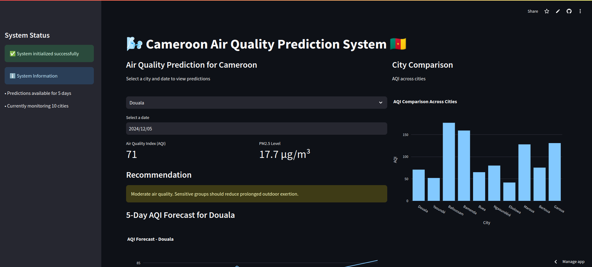
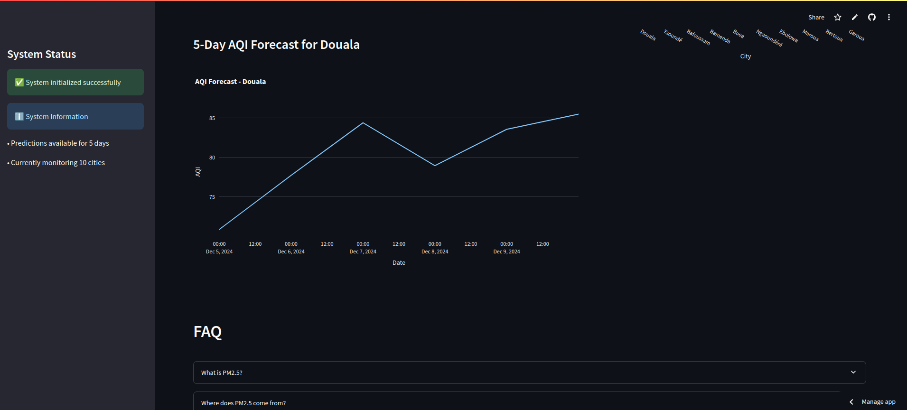

 # **Air Quality Prediction System for Cameroon**

This repository hosts the codebase for an end-to-end machine learning system designed to predict air quality across the ten major cities of Cameroon. By leveraging satellite data, weather information, and advanced machine learning workflows, this project eliminates the need for unreliable ground-based sensors in resource-constrained settings.

The system is fully autonomous, and get better over time with automatic model retraining and redeployment when drift is detected.

# Features

1. **End-to-End Architecture**:
   
- Data Pipeline: Automates daily data fetching, transformation, and storage using Prefect.
  
- Offline Components: Includes EDA, model development, and a robust model registry with MLflow.
  
- CI/CD Pipeline: Automates testing, building Docker images, and deployment to AWS ECS using GitHub Actions.
  
- Monitoring Pipeline: Tracks data drift using Evidently, sends alerts, and integrates seamlessly with the data pipeline.
  
- Model Retraining Pipeline: Retrains the model weekly, compares performance, and redeploys only if the new model outperforms the production model.


2. **Scalable Deployment**:

- Hosted on AWS ECS with containerized model APIs for high availability.
- Integrated with a Load Balancer to ensure stable traffic routing despite dynamic IP changes.

3. User-Friendly Interface:
   
- Streamlit Cloud host an interactive UI for visualizing air quality predictions and insights.

# System Architecture

The system is composed of the following key components:

- **Data Pipeline**:

Runs daily at 01:00 AM using Prefect.
Fetches weather and AQI data for ten cities, merges, transforms, and stores historical data for retraining.

- **Offline Development**:

EDA and Preprocessing: Comprehensive exploratory data analysis and feature engineering.
Model Training: Uses MLflow for experiment tracking and maintains a version-controlled model registry.

- **CI/CD Pipeline**:

Ensures seamless deployment through GitHub Actions.
Automatically builds, tests, and deploys FastAPI-based model APIs on AWS ECS.

- **Monitoring Pipeline**:

Detects data drift using Evidently by comparing historical and incoming data distributions.
Sends email alerts when drift exceeds predefined thresholds. 

- **Model Retraining**:

Retrains the model weekly with new data and compares performance metrics.
Automatically triggers deployment of the best-performing model.

- **Load Balancer**:

Resolves issues with ECS dynamic IP changes by forwarding traffic through a stable DNS endpoint.

- **UI**:

A Streamlit-based interface provides real-time insights into air quality predictions.



<br>

# Getting Started

## Prerequisites

- Python 3.10.12
- Docker
- AWS CLI configured with necessary permissions
- Prefect Cloud account for orchestration
- GitHub repository with Actions enabled

## Installation

1. Clone the repository:

```bash
git clone https://github.com/NembotJules/Cameroon-Air-Quality-Prediction.git
```

2. Install dependencies:

```bash
pip install requirements.txt
```

3. Configure AWS credentials for ECS and ECR:
```bash
aws configure
```

4. Start the prefect server and follow the instructions in the terminal to direct the Prefect API URl to Prefect Cloud

```bash
prefect server start
```

5. Create an S3 Bucket, and update the paths in the config/default.yaml to match your paths.
   

6. Set environment variables

- Add required API keys (e.g., Openmeteo API) and other configuration values to .env or your secrets manager. <br>
  

7. Deploying the API
 
The model API is deployed automatically through the CI/CD pipeline, but you can deploy it manually:

```bash
docker build -t air-quality-api .  
docker tag air-quality-api:latest <AWS_ECR_REPO_URI>:latest  
docker push <AWS_ECR_REPO_URI>:latest  
```

8. Deploy your ECR Image to AWS ECS 

9. Update the data_pipeline script to send data to your AWS ECS service public ip address

10. Run the data_pipeline.py script

```bash
python data_pipeline.py
```

11. You can use the script in the monitoring folder to Monitor the system using Evidently, adapt the script to your preference.

```bash
python monitoring_service.py
```
12. Use the workflow file in the githuv folder to automate everything.


# Project Structure

```bash
.
├── .github/workflows/         # GitHub Actions workflows for CI/CD, monitoring, and retraining pipelines
│   ├── air_quality_ci_cd.yml
│   ├── monitoring_pipeline.yml
│   └── retraining.yml
├── config/                    # Configuration files
│   └── default.yaml
├── data/                      # Directory for all data-related files
│   ├── daily_weather_data/    # Raw daily weather data
│   ├── hourly_aqi_data/       # Raw hourly AQI data
│   ├── train_test_data/       # Training and test data
│   │   ├── preprocessed_data/ # Preprocessed datasets
│   │   │   ├── train_X.csv
│   │   │   ├── train_y.csv
│   │   │   ├── test_X.csv
│   │   │   └── test_y.csv
│   │   └── raw_data/          # Raw datasets before preprocessing
├── monitoring/                # Monitoring service code
│   └── monitoring_service.py
├── models/                    # ML models and training scripts
│   ├── __init__.py
│   └── train_model.py
├── notebooks/                 # Jupyter notebooks for analysis
│   ├── data_processing.ipynb  # Data cleaning and preprocessing
│   ├── Modeling.ipynb         # Model experimentation and evaluation
│   ├── Kaggle Split.ipynb     # Data splitting logic
│   └── feature_importance_plot.png
├── src/                       # Core source code
│   ├── api/                   # FastAPI application
│   │   ├── app.py
│   │   └── test_api.py
│   ├── data/                  # Data pipeline scripts
│   │   ├── data_pipeline.py
│   │   ├── make_dataset.py
│   │   ├── combined_daily_aqi_df.csv
│   │   ├── combined_daily_weather_df.csv
│   │   └── daily_weather_aqi_df.csv
│   └── processed_features.csv # Final feature dataset
├── ui/                        # Streamlit-based user interface
│   ├── aqi.py
│   ├── historical_daily_weather.py
│   ├── historical_hourly_aqi.py
│   └── upload_to_s3.py
├── .devcontainer/             # Development container configuration
├── backend.db                 # Backend database file
├── Dockerfile                 # Dockerfile for containerizing the application
├── requirements.txt           # Python dependencies
├── task-definition.json       # ECS task definition for deployment
└── .env                       # Environment variables (not included in the repository for security)

```


# Image of the System: 

 


